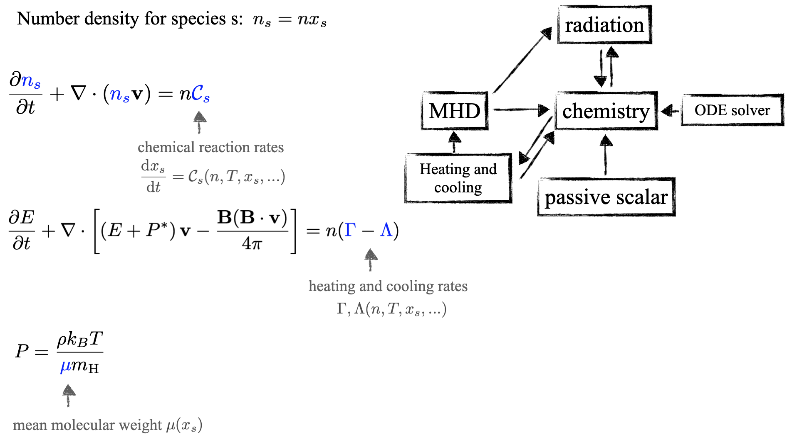
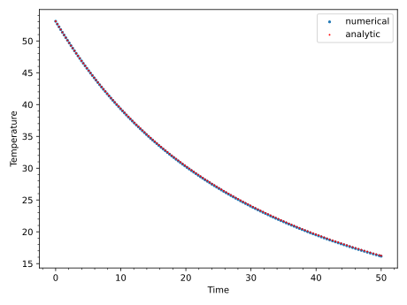
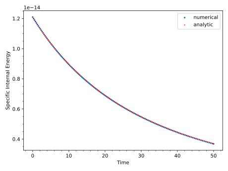
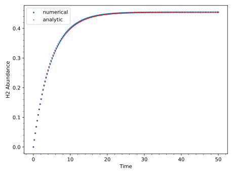
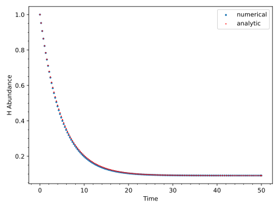
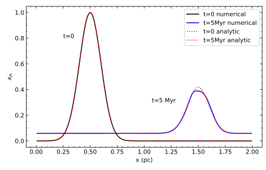
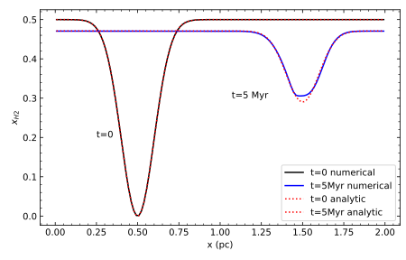

Chemistry
=========

**If you use this chemistry module in your publication, please cite the
accompanying code paper** `Gong et
al. (2023) <https://ui.adsabs.harvard.edu/abs/2023ApJS..268...42G/abstract>`__\ **.**
The paper also provides some more details beyond this documentation.

Formulation
-----------

Chemistry uses the basic functionality of the
passive scalars included in the :doc:`hydro` or :doc:`mhd` modules. The
reaction rates act as a source term for the passive scalars. It can also
interact with other parts of the code, e.g. heating and cooling rates in
the energy equation, opacity in radiation transfer, etc.

Solving Chemistry
-----------------

Because the chemical reaction rates for different species often differ
by orders of magnitude, implicit solvers are better suited to solve the
rate equations. We use the operator split method: after the
``hydro``/``mhd`` solver has finished, we advance the chemical
abundances and the internal energy for the hydrodynamic time step dt, by
solving a set of coupled ODEs of chemical rate equations and
heating/cooling implicitly:

.. math:: \frac{\mathrm{d} x_s}{\mathrm{d} t} = \mathcal{C}_s

.. math:: \frac{\mathrm{d} e}{\mathrm{d} t} = n(\Gamma - \Lambda)

In the code, the reaction rate :math:`\mathcal{C}_s` and the
:math:`\frac{de}{dt}` (heating and cooling) are computed in the
``evaluate_function`` method of the various chemistry network classes.
Because the chemical reaction rate :math:`\mathcal{C}_s` usually depends
on the temperature ``T``, the user often need to have some expression of
``T`` as a function of the internal energy ``e`` in their RHS.
Currently, chemistry works with a adiabatic equation of state with a
fixed adiabatic index set by the ``gamma`` parameter in the ``hydro`` or
``mhd`` modules. General EOS dependence on chemistry has not been
included yet.

Note that the passive scalar advection (and diffusion) is solved
separately prior to the chemical rate equations. This operator split
method is only first-order accurate. The forced conservation of
elemental abundances (such as by rescaling the flux of different
species) has not been implemented yet. Relatively small errors are
usually found for elemental conservation from ODE solvers.

Running the Code
----------------

Input File
~~~~~~~~~~

To run with chemistry you need to include the ``<chemistry>`` block in
the input file. Within that you have the following parameters

+------------+--------+---------------+-----------------------+------------------------------------------------------+
| Option     | Type   | Allowed       | Default                | Description                                         |
|            |        | Values.       |                        |                                                     |
+============+========+===============+========================+=====================================================+
| network    | string | H2, GOW17     | None, mandatory flag   | The chemistry network to use. Options include:      |
|            |        |               |                        | ``H2`` and ``GOW17``\ (upcoming). These networks    |
|            |        |               |                        | often have their own runtime parameters which are   |
|            |        |               |                        | detailed in their respective sections below.        |
+------------+--------+---------------+------------------------+-----------------------------------------------------+
| ode_solver | string | forward_euler | None, mandatory flag   | The ODE solver to use. See the :doc:`ode_solvers`   |
|            |        |               |                        | page for which solvers are available and any        |
|            |        |               |                        | runtime parameters they may have.                   |
+------------+--------+---------------+------------------------+-----------------------------------------------------+
| mu_H       | Real   | any real > 1  | 1.4                    | The mean molecular mass per hydrogen nucleon        |
+------------+--------+---------------+------------------------+-----------------------------------------------------+

Chemistry also requires that the :doc:`units` module be enabled. A good
default set of units to use for ISM chemistry is:

::

   <units> 
   # ISM units
   length_cgs  = 3.0856775809623245e+18  # length is 1 pc
   mass_cgs    = 6.195900228622575e+31   # number density is 1 cm^-3
   time_cgs    = 3.15576e+13             # time is 1 Myr
   mu          = 1.4                     # mean molecular weight

Chemistry
---------

Passive Scalars
~~~~~~~~~~~~~~~

The chemical species uses the passive scalar structure in the code. By
default, the number of species is the number of scalars. If the user
wants additional passive scalars to be added (for example, tracer
scalars that is not involved in chemical reactions), the number of
scalars can be set separately in the ``nscalars`` parameter.

Existing Chemical Networks
~~~~~~~~~~~~~~~~~~~~~~~~~~

H2
^^

This is a 2-species HI-H2 network. Although this network is very
simplified and does not represent the realistic HI-H2 transition in the
ISM, it has the advantage of having an analytic solution when
:math:`C_v` is constant, and is used in tests.

Runtime parameters for the H2 network, these go inside the
``<chemistry>`` block:

+---------------------+--------+---------------+---------+--------------------------------------------+
| Option              | Type   | Allowed       | Default | Description                                |
|                     |        | Values        |         |                                            |
+=====================+========+===============+=========+============================================+
| h2_constant_cv      | bool   | true, false   | false   | Whether or not :math:`C_v` should be       |
|                     |        |               |         | constant. If true then :math:`C_v` is set  |
|                     |        |               |         | to :math:`1.65*K_b`                        |
+---------------------+--------+---------------+---------+--------------------------------------------+
| h2_isothermal       | bool   | true, false   | false   | If the H2 network should use an isothermal |
|                     |        |               |         | EOS, i.e. set the change in internal       |
|                     |        |               |         | energy to zero                             |
+---------------------+--------+---------------+---------+--------------------------------------------+

GOW17
^^^^^

*The GOW17 network is not yet implemented*

.. raw:: html

   <!-- The GOW17 network is from the work of [Gong, Ostriker and Wolfire (2017)](https://ui.adsabs.harvard.edu/abs/2017ApJ...843...38G/abstract). It is a widely used and well-tested network for carbon and oxygen chemistry in the atomic and molecular ISM. It has the advantage of being relatively simple with only 18 species and about 50 reactions, and is still accurate in capturing the most important chemical and thermal processes compared to more sophisticated networks. -->

Timestep details
~~~~~~~~~~~~~~~~

Currently, the overall chemical timestep is the same as the hydro
timestep: the ODE solver advances the chemical abundances and energy for
a single hydro timestep. Note that the ODE solver may use subcycling
internally, and the subcycling timestep may be adjusted to ensure the
solution converges, but this process is hidden from the user. The
overall timestep can be reduced by lowering the CFL number and the ODE
solvers generally have runtime options to make them more accurate at the 
cost of more iterations.

Test Problems
-------------

H2 Uniform
~~~~~~~~~~

This test problem has a constant hydrodynamic background and follows the
evolution of the H and H2 abundances. It has an analytic solution and
details can be found in Section 4.1 of `Gong et
al. (2023) <https://ui.adsabs.harvard.edu/abs/2023ApJS..268...42G/abstract>`__.

- Input File:
  `H2_uniform.athinput <https://github.com/IAS-Astrophysics/athenak/blob/chemistry-KokkosODE/inputs/chemistry/H2_advection.athinput>`__
- ``pgen_name``: H2_uniform

Problem generator parameters, all are within the ``<problem>`` block
unless otherwise specified:

+-------------------------+------+-----------+---------------------------------------------+
| Option                  | Type | Default   | Description                                 |
+=========================+======+===========+=============================================+
| n_H                     | Real | mandatory | The number density of hydrogen              |
+-------------------------+------+-----------+---------------------------------------------+
| hydro/iso_sound_speed   | Real | mandatory | The isothermal sound speed defined in the   |
|                         |      |           | ``<hydro>`` block                           |
+-------------------------+------+-----------+---------------------------------------------+
| vx_kms                  | Real | mandatory | The x velocity in km/s                      |
+-------------------------+------+-----------+---------------------------------------------+
| init_H                  | Real | mandatory | The initial abundance of hydrogen gas       |
+-------------------------+------+-----------+---------------------------------------------+
| init_H2                 | Real | mandatory | The initial abundance of molecular hydrogen |
+-------------------------+------+-----------+---------------------------------------------+

Time Evolution of the H2 Uniform Test
^^^^^^^^^^^^^^^^^^^^^^^^^^^^^^^^^^^^^

|H2 Uniform Temperature| |H2 Uniform Specific Internal Energy| |H2
Uniform H2 Abundance| |H2 Uniform H Abundance|

H2 Advecting Gaussian
~~~~~~~~~~~~~~~~~~~~~

This test problem has a Gaussian profile in H and H2 abundances with a
constant velocity in :math:`x`. It has an analytic solution and details
can be found in Section 4.1 of `Gong et
al. (2023) <https://ui.adsabs.harvard.edu/abs/2023ApJS..268...42G/abstract>`__.

- Input File:
  `H2_advection.athinput <https://github.com/IAS-Astrophysics/athenak/blob/chemistry-KokkosODE/inputs/chemistry/H2_advection.athinput>`__
- ``pgen_name``: H2_advection

Problem generator parameters, all are within the ``<problem>`` block
unless otherwise specified:

+-------------------------+------+-----------+-------------------------------------------+
| Option                  | Type | Default   | Description                               |
+=========================+======+===========+===========================================+
| n_H                     | Real | mandatory | The number density of hydrogen            |
+-------------------------+------+-----------+-------------------------------------------+
| hydro/iso_sound_speed   | Real | mandatory | The isothermal sound speed defined in the |
|                         |      |           | ``<hydro>`` block                         |
+-------------------------+------+-----------+-------------------------------------------+
| vx_kms                  | Real | mandatory | The x velocity in km/s                    |
+-------------------------+------+-----------+-------------------------------------------+
| init_H                  | Real | 0.0       | The initial abundance of hydrogen gas     |
+-------------------------+------+-----------+-------------------------------------------+
| gaussian_mean           | Real | 0.5       | The mean of the initial Gaussian profile  |
+-------------------------+------+-----------+-------------------------------------------+
| gaussian_std            | Real | 0.1       | The standard deviation of the initial     |
|                         |      |           | Gaussian profile                          |
+-------------------------+------+-----------+-------------------------------------------+

Initial and Final States of the H2 Advection Test Compared to the Analytical Solution with ``nx=128``
^^^^^^^^^^^^^^^^^^^^^^^^^^^^^^^^^^^^^^^^^^^^^^^^^^^^^^^^^^^^^^^^^^^^^^^^^^^^^^^^^^^^^^^^^^^^^^^^^^^^^

|H2 Advection H| |H2 Advection H2|

